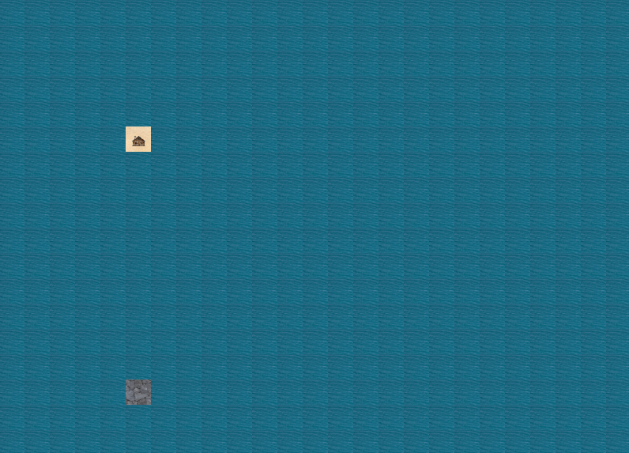
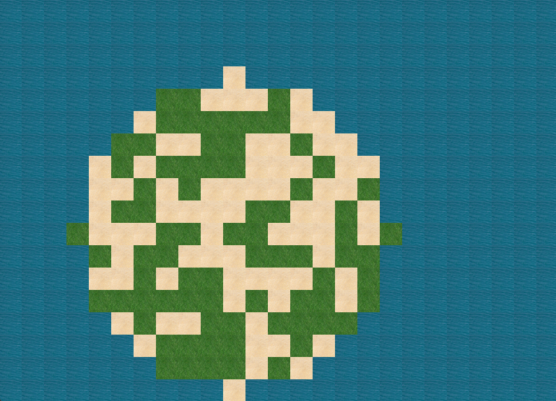
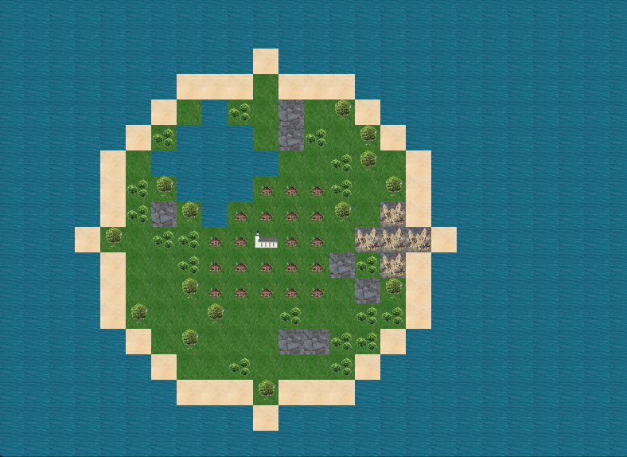
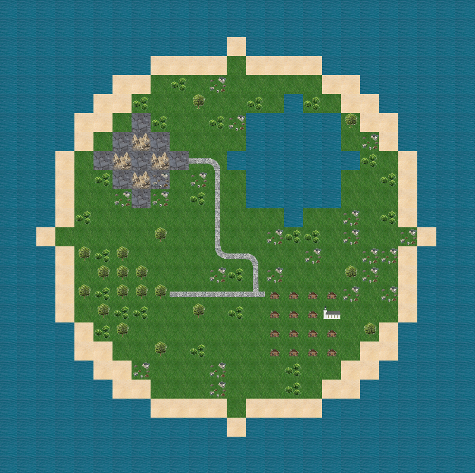

# Mapper

## Przygotowanie środowiska
### Aby wygenerować parser w języku Python z pliku gramatyki Mapper.g4, użyj jednej z poniższych metod:
- Jeśli masz alias 'antlr4':
```bash
$ antlr4 -Dlanguage=Python3 -visitor Mapper.g4
```

### Jeśli nie masz aliasu, użyj pełnej ścieżki:
```bash
$ java -jar C:\antlr\antlr-4.13.2-complete.jar -Dlanguage=Python3 -visitor Mapper.g4
```

### Uruchamianie skryptu Python - wybór jednej z opcji:
1. Instalacja wymaganych pakietów
```bash
$ pip install requirements.txt
```
2. Aby uruchomić interpreter dla pliku example.map, wykonaj:
```bash
$ py MapperInterpreter.py example.map
```
lub
```bash
$ python MapperInterpreter.py example.map
```

## Przykład użycia

### Rysowanie obiektów
**Tile** - płytka do wyświetlenia, można ustawić:
- obiekt na pierwszym planie np. drzewo, krzaki, chatka
- obiekt w tle np. trawa, piasek, woda

**Pointer** - zmienia aktualne położenia, na które możemy położyć płytkę
```
tile mojaplytka = sand + cabin 
tile drugaplytka = rocks

draw mojaplytka

pointer down 10
draw drugaplytka
```



### Rysowanie zbioru płytek
**Blend** - tworzy zbiór płytek w podanym kształcie, w podanych proporcjach
```
blend mojblend = circle 10 sand 50% grass 50%
draw mojblend
```



### Łączenie tile i blend
```
pointer up 1
blend wyspa = circle 7 sand 100%
draw wyspa

blend zielenie = circle 6 tree 20% rocks 10% bush 30% grass 60%
draw zielenie

pointer up 2
pointer left 2 

blend village = rectangle 5 5 cabin 80%
draw village

pointer down 2
pointer right 2
draw church

pointer right 5
tile rockmountain = rocks + mountains
blend gory = circle 1 rockmountain 80%
draw gory

pointer left 7 
pointer up 3
blend lake = circle 2 water 100%
draw lake
```


### Rysowanie dróg 
**Road** - ustawia się miejsce początkowe i końcowe i algorytm generuje losową ścieżkę łączącą te dwa punkty
```
road roadA start
pointer down 10
pointer left 10
road roadA end
```

Jeżeli na jakiejś płytce znajduje się więcej niż jedna drogi, zostają one połączone w jedną

```
blend island_sand = circle 10 sand 100%
draw island_sand

blend island_green = circle 9 tree+grass 10% bush+grass 15% grass+stones 10% grass 65%
draw island_green

pointer up 4
pointer right 3
blend lake = circle 3 water 100%
draw lake

pointer left 8

blend rocks_terrain = circle 2 rocks 80% rocks+stones 20%
blend mountains = circle 1 rocks+mountains 80% rocks 20%
draw rocks_terrain
draw mountains

pointer right 1
road mountain_village start
pointer right 6
pointer down 7

blend village = rectangle 4 4 cabin 90% church 10%
draw village

road mountain_village end

blend forest = circle 2 grass+bush 30% tree 70%
road village_forest start

pointer left 8
draw forest

pointer right 2
road village_forest end
```




